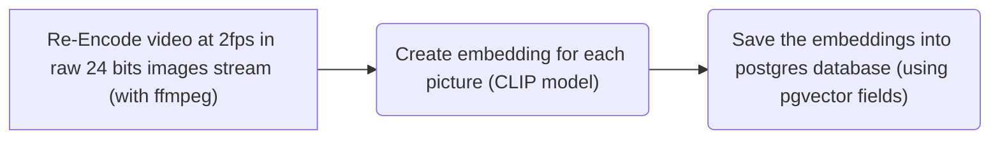

# What is it ?
This is a tool to automaticaly figure out what are the opening / ending in shows
It uses video embddings with `CLIP` models to find similarities between frames

It's slow AF (even with a GPU) so don't try to use it for anything else than research

TODO: use sound signature instead of video...

# WSL steps
```shell
wsl --install -d Ubuntu
```

```bash
sudo apt install pkgconf build-essential yasm cmake libtool libc6 libc6-dev unzip wget libnuma1 libnuma-dev

git clone https://git.videolan.org/git/ffmpeg/nv-codec-headers.git
cd nv-codec-headers && sudo make install && cd ..
git clone https://git.ffmpeg.org/ffmpeg.git ffmpeg/

cd ffmpeg
PKG_CONFIG_PATH=/usr/local/lib/pkgconfig/ ./configure --enable-nonfree --enable-cuda-nvcc --enable-libnpp --extra-cflags=-I/usr/local/cuda/include --extra-ldflags=-L/usr/local/cuda/lib64 --disable-static --enable-shared --enable-cuvid --enable-nvenc
make -j
sudo make install
```

# How does it works
There is 2 parts: the indexing and the search

## indexing
The indexing part is when we create the embedding for the similarity search that will come later, this part is LONG in term of time.

With a 7950X3D and a RTX 3080 it takes around 2 minutes for each 20mins episode in a folder.



## Search
The search is almost instant, the process is:


# Conclusion
So far this aproach is not usable in real life: it takes too long to use video for similarity detection with the current hardware

# Usefull links
- https://docs.nvidia.com/video-technologies/video-codec-sdk/12.0/ffmpeg-with-nvidia-gpu/index.html
- https://huggingface.co/docs/transformers/v4.19.2/en/model_doc/clip#transformers.CLIPFeatureExtractor
- https://trac.ffmpeg.org/wiki/HWAccelIntro
- https://blog.programster.org/add-chapters-to-mkv-file
